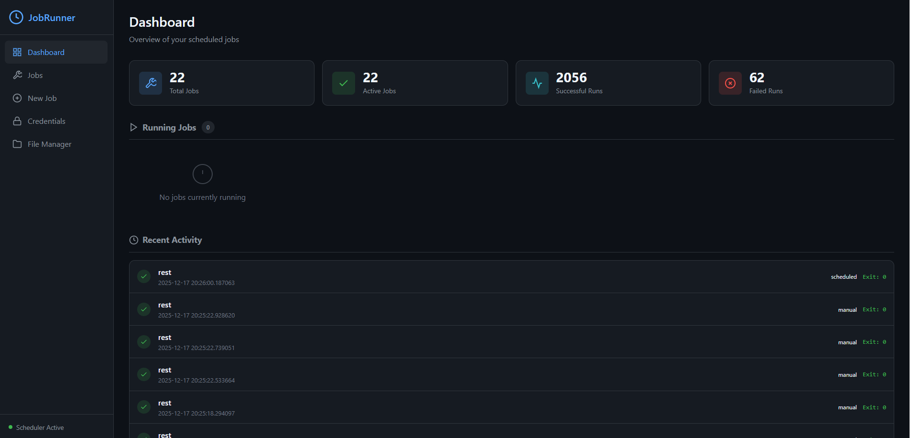
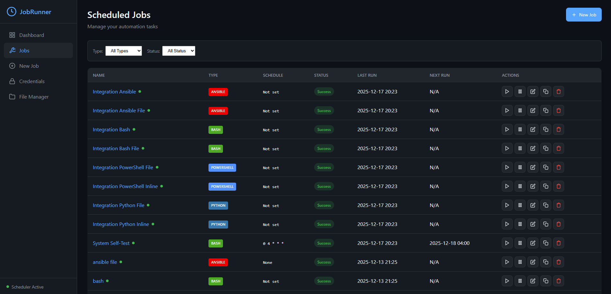
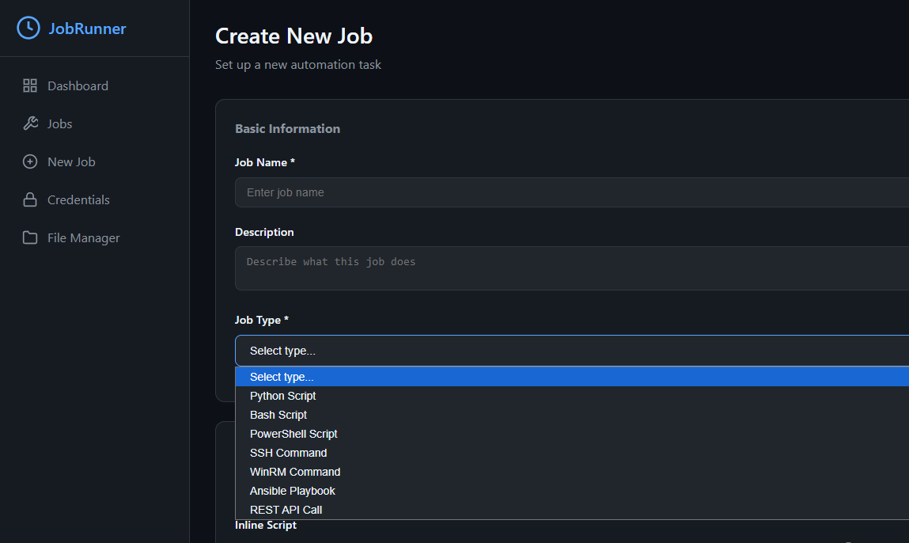
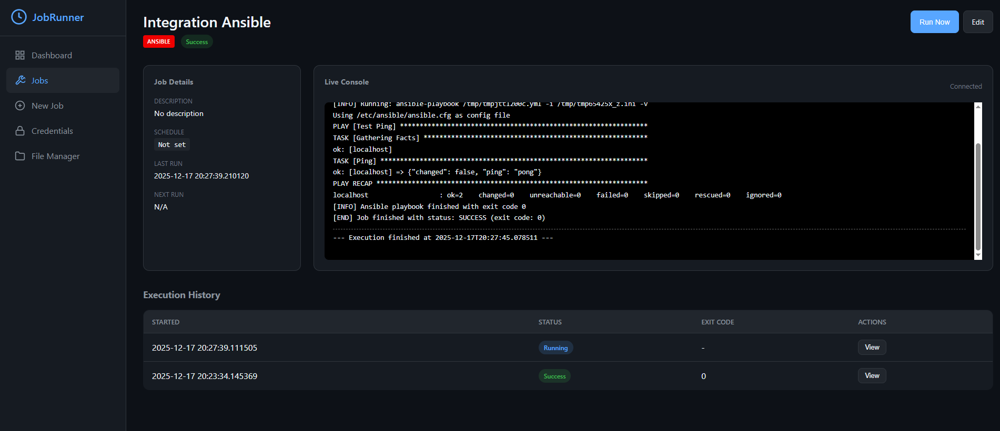
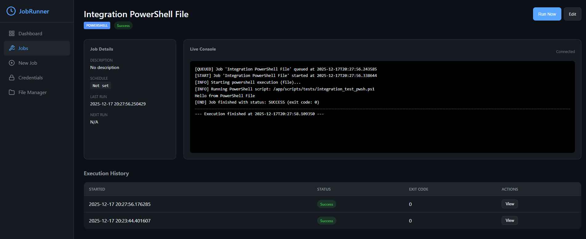
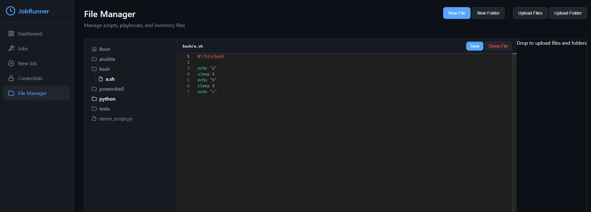

# JobRunner

<div align="center">



**A powerful, Flask-based task scheduler for managing and executing automation scripts across your infrastructure.**

</div>

---

## Overview

JobRunner acts as a central control plane for running Python, Bash, and PowerShell scripts, as well as Ansible playbooks. It provides a modern web interface with real-time job status updates, flexible scheduling options, and secure credential management for remote execution.

## Screenshots

### Dashboard

*Overview dashboard showing running jobs, recent activity, and system statistics.*

### Jobs List

*Manage all your scheduled and ad-hoc jobs in one place.*

### Create New Job

*Intuitive job creation form with support for multiple execution types.*

### Ansible Playbooks

*Run Ansible playbooks with inline or file-based inventories.*

### PowerShell Execution

*Execute PowerShell scripts locally or remotely via WinRM.*

### File Manager

*Browse and manage your script files directly from the web interface.*

---

## Features

### Core Capabilities
- **Multi-Language Support** — Execute Python, Bash, and PowerShell scripts natively
- **Ansible Integration** — Run playbooks with inline or file-based inventories
- **Remote Execution** — SSH and WinRM support for remote servers
- **Flexible Scheduling** — Cron expressions, fixed intervals, or one-time runs

### Real-Time Updates
- **Live Logs** — WebSocket streaming for real-time execution logs
- **Dynamic Status** — Jobs update instantly across all views without page refresh
- **Queue Management** — Jobs queue automatically when already running

### User Experience
- **Modern Dashboard** — Clean, responsive UI with dark mode support
- **Job Duplication** — Clone existing job configurations with one click
- **File Browser** — Built-in file manager for script management
- **Credential Vault** — Secure storage for passwords, SSH keys, and API tokens

### Developer Features
- **REST API** — Full programmatic control over jobs and execution
- **Docker Ready** — Containerized deployment with docker-compose
- **Extensible** — Plugin-based executor architecture

---

## Tech Stack

| Component | Technology |
|-----------|------------|
| Backend | Flask, SQLAlchemy, APScheduler |
| Real-time | Flask-SocketIO, Gevent |
| Database | SQLite (default), PostgreSQL (optional) |
| Frontend | Vanilla JS, Socket.IO Client |
| Containerization | Docker, Docker Compose |

---

## Quick Start

### Using Docker (Recommended)

```bash
git clone https://github.com/devopsteamsdb/JobRunner.git
cd JobRunner
docker-compose up -d
```

Access the dashboard at `http://localhost:5000`

### Manual Installation

1. Clone the repository:
   ```bash
   git clone https://github.com/devopsteamsdb/JobRunner.git
   cd JobRunner
   ```

2. Create a virtual environment:
   ```bash
   python -m venv .venv
   # Windows
   .venv\Scripts\activate
   # Linux/Mac
   source .venv/bin/activate
   ```

3. Install dependencies:
   ```bash
   pip install -r requirements.txt
   ```

4. Run the application:
   ```bash
   python app.py
   ```

5. Access the dashboard at `http://localhost:5000`

---

## Configuration

Environment variables can be set in a `.env` file or passed directly:

| Variable | Description | Default |
|----------|-------------|---------|
| `SECRET_KEY` | Flask secret key | Auto-generated |
| `DATABASE_URL` | Database connection string | `sqlite:///scheduler.db` |
| `SCHEDULER_TIMEZONE` | Timezone for scheduling | `UTC` |

---

## API Reference

### Jobs

| Method | Endpoint | Description |
|--------|----------|-------------|
| `GET` | `/api/jobs` | List all jobs |
| `POST` | `/api/jobs` | Create a new job |
| `GET` | `/api/jobs/<id>` | Get job details |
| `PUT` | `/api/jobs/<id>` | Update a job |
| `DELETE` | `/api/jobs/<id>` | Delete a job |
| `POST` | `/api/jobs/<id>/run` | Trigger job execution |

### Logs

| Method | Endpoint | Description |
|--------|----------|-------------|
| `GET` | `/api/logs/recent` | Get recent job logs |
| `GET` | `/api/jobs/<id>/logs` | Get logs for a specific job |

---

## License

[MIT](LICENSE)
